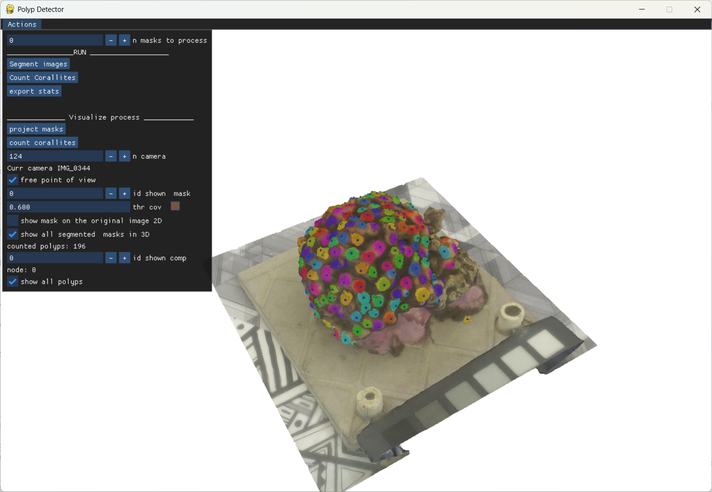

# coralab

#to install all required modules run
pip install -r requirements.txt

#launch polypstats_launcher.py to select the paths (leave the last three paths empty)
#this step will produce a file named last.txt. That's the "project" file
python polypstats_launcher.py

#if current paths are already set (last.txt exists) you can launch polypstats.py directly
python polypstats.py 

